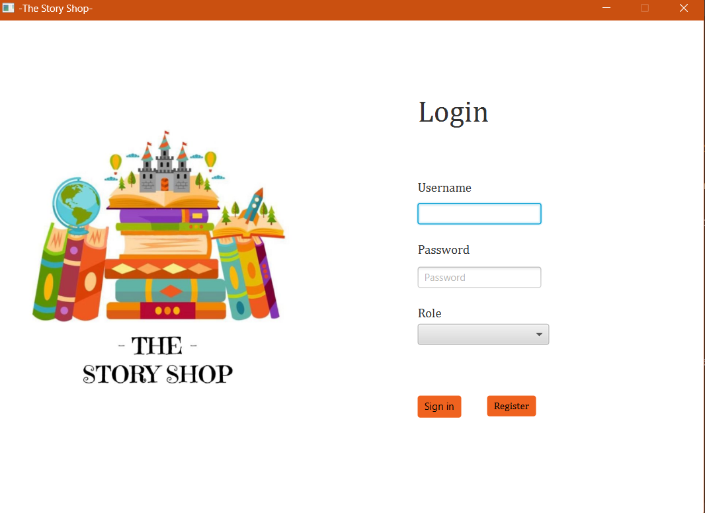

# 🏰 Bookstore App 🏰

## 🌍 Overview

Our bookstore app, named The Story Shop, is a Java application developed using JavaFX. Its purpose is to provide an intuitive and efficient solution for managing a bookstore. The app caters to two distinct user roles: clients and bookstore managers. 

## 📸 Preview

<div>
  
  
  
  
</div>

## 💡 Features

### 👤 <u>Client Role</u>

Clients can benefit from the following features:

🔐 **Login/Account Creation**: Clients can create a new account or log in to their existing one. Passwords are securely encrypted using SHA-256.

📚 **Book Categories**: Clients have access to six distinct book categories: Fantasy, Crime, Drama, Romance, Self-Improvement, and Vintage.

🗺️ **Book Listing**: Upon selecting a category, clients can browse through a diverse range of available books. Each listing includes details such as author, name, and description.

🛒 **Shopping Cart**: Clients can conveniently add books to their shopping cart while browsing. The cart keeps track of the selected items.

💳 **Order Placement**: Clients can easily place orders by providing essential details, such as name, address, postal code, and telephone number.

📜 **Order History**: Clients can access their order history to track the status of each previously placed order.

### 👤 <u>Manager Role</u>

Managers have additional functionalities for effective bookstore management:

🔐 **Login/Account Creation**: Managers can log in to their existing account or create a new one.

📋 **Book Management**: Managers have the authority to add new books to the bookstore's inventory or remove existing ones. They are required to provide essential details such as title, author, price, picture, and a description.

📦 **Order Processing**: Managers can efficiently process incoming orders from clients, updating the order status accordingly.

## 💻  Running the Application

#### Option 1️⃣: Cloning the Repository

1. Begin by cloning the repository using the following command:

   ```
   git clone https://github.com/your-username/bookstore-app.git
   ```

2. Once the cloning process is complete, proceed to install the required dependencies.

3. After installing the dependencies, you can build and run the application.

#### Option 2️⃣: Running the JAR file

1. Ensure you have the JavaFX SDK installed on your system.

2. Open a terminal or command prompt.

3. Navigate to the directory where the `BookStore.jar` file is located.

4. Run the following command, replacing `<path-to-javafx-sdk>` with the actual path to your JavaFX SDK:

   ```bash
   java --module-path <path-to-javafx-sdk>/lib --add-modules javafx.controls,javafx.fxml,javafx.graphics,javafx.web -jar BookStore.jar
   ```
